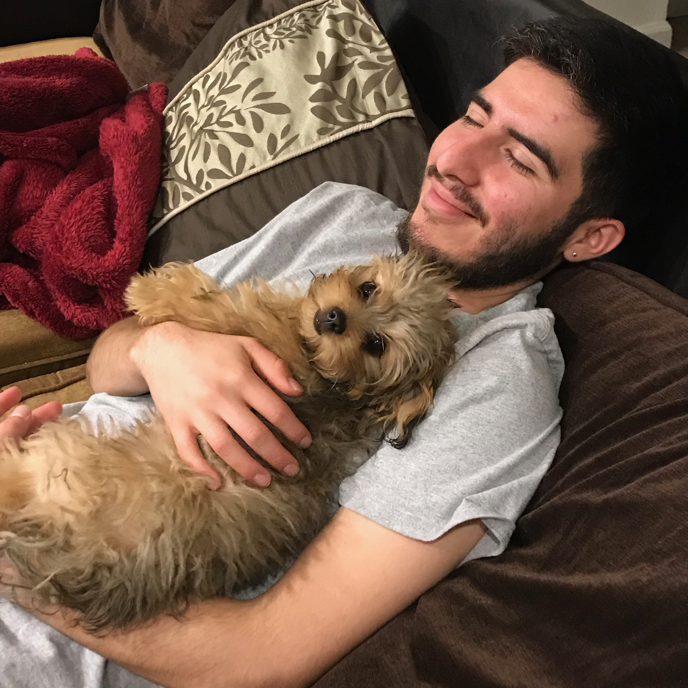

# UX Portfolio

Hello! My name's Danny. I've always been interested in design, whether it's graphic design, product design, or fashion because of its ability to greatly impact people's lives. This is why I chose Communication Design as my major here at CSU, Chico. A friend of mine talks to me a lot about how certain social media companies use UX/UI to make their apps or sites as addictive as possible. This is really fascinating to me which is why he recommended I take CSCI 431. I'm interested in learning about Usability Engineering so I can use it to maybe create more humane design for the masses, design that won't take advantage of people's addictive personalities. My career field is more and more intertwined with apps, websites, software, and all things tech so I feel this class will prepare me for that kind of a design world. 
## UX Team Project

## UX Journal

[This is my first journal entry.](journal-01)
